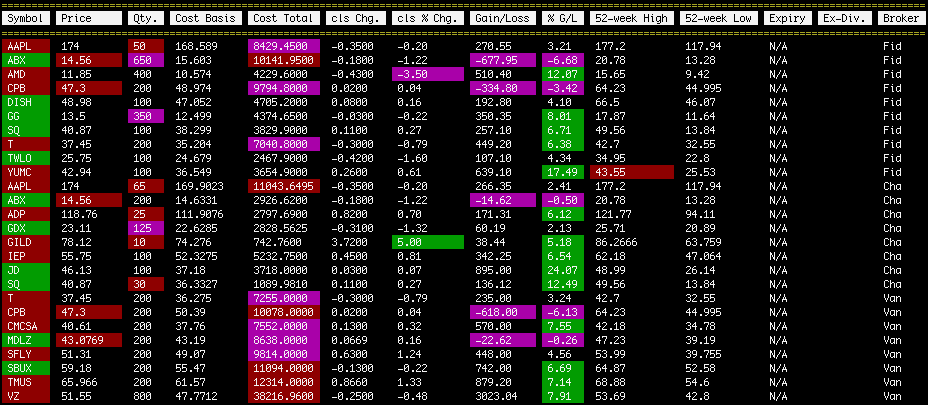

# Realtime Market Dashboard

## Motivation
2017 marked another incredible bull run in stock markets.  My portfolio, managed solely by myself, gained 20 points.  I took my profit and ran.  Looking back at the trades I made, it was a nightmare to track all my positions because I have 5 different brokers.  _I need to __consolidate__ all my positions_.

## Why reinvent the wheel?
*What about using Yahoo! Finance to track all your positions, or other financial tools that import from brokers?*

Well, I could. I am definitely not solving a unique problem here, but __customization__ is what I am after.

## Preliminary Research

This should be no rocket science, the following plan should suffice:
 1. a market data provider
 1. a network library
 2. get data in JSON and parse them
 3. add customized technical and fundamental indicators

## Runtime Environment

I want this dashboard to run in a command line/terminal environment.  It should run anywhere and take no effort to set up.  I decided to use the following languages:
  * Ruby
  * Bash
  * JavaScript (not anticipated initially, see **Challenge #3**)

## Challenge # 1

I need a market data provider that is _both_ free and realtime.  Yahoo! Finance is free but its data are delayed by 15 minutes.  Fortunately I was able to use E\*Trade.

## Challenge # 2

I was surprised to learn that E\*Trade still uses OAuth 1.0a.  Instead of looking for a library, I actually implemented the OAuth 1.0a specs.  This turned out to be the hardest challenge, because any wrongly encoded character can yield incorrect signature and E\*Trade is not going to tell you what was wrong.

## Challenge # 3
This challenge sprouts from how OAuth works.  In order to obtain tokens from provider, user has to log in via E\*Trade web site with his/her credentials.  This means I need to automate something that will launch a browser, log user in, and obtain tokens.  Thankfully there is a JavaScript library for this.

## Challenge # 4
Since E\*Trade has its own set of APIs, I have decided to create a ruby gem (instead of just a Ruby program), so it can be reused as a library for future Ruby projects.  This Ruby gem will also have OAuth 1.0a support, which is perfect to be in a library.

## Result
Below is the demo.  Ideally you won't be querying data every 15 seconds, but for the purpose of demo I want to show how it is displayed and updated in command line.
Keep in mind the following:

- _green_ color means _upward movement_, or _buying opportunity_
- _red_ color means _downward movement_, _sell_, or _threshold reached_
- _purple_ color means _watch_, or _caution_

## Where is your source code?

Unfortunately I won't be releasing my source code right now, but I might consider releasing the gem in the future.

## What is left?

There are more features I would like to do such as options, more complicated technical analysis, and an automated way to actually place an order when all my indicators are satisfied.  I will continue on this project whenever I have time.
